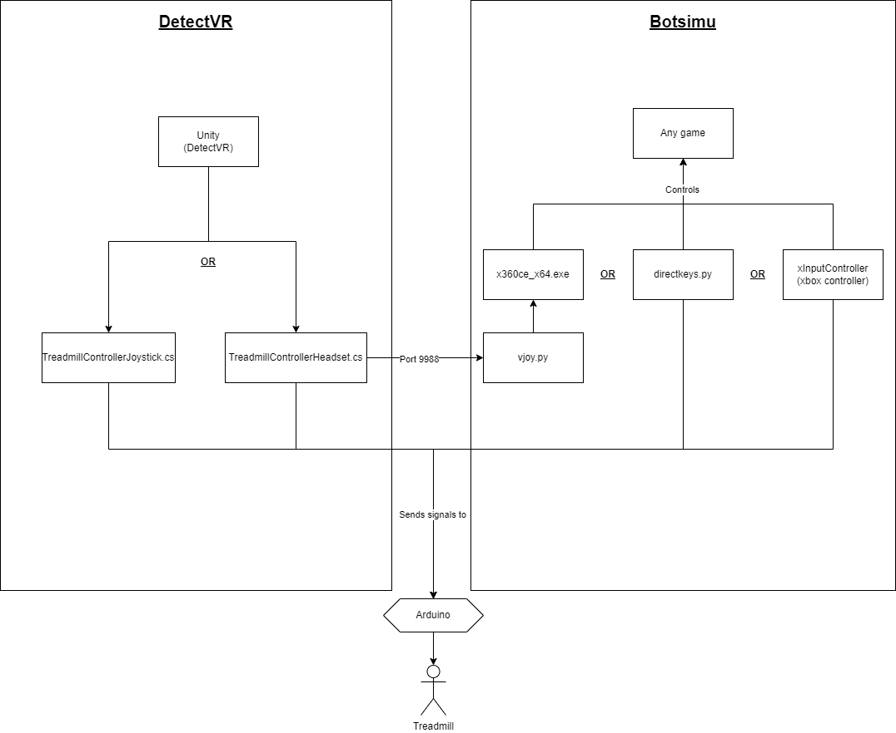

# Purpose

The project had one purpose in mind: control a treadmill (with different inputs) connected to an arduino. The current supported inputs are:

1. Virtual reality headset position
2. Xbox controller
3. Keyboard

The project located in repository https://github.com/KevinChenier/DetectVR controls a treadmill connected to an arduino with two different inputs:

1. Oculus rift controllers (TreadmillControllerJoystick.cs)
2. Virtual reality headset position (TreadmillControllerHeadset.cs)

# How it works

The TreadmillControllerJoystick.cs script handles the Oculus controllers inputs and sends the proper signals to the arduino, which in turns controls the treadmill speed. There is another way to control the treadmill speed, and this is achieved with the script TreadmillControllerHeadset.cs. This script takes into account a hard coded position in your environment, which mimics the behaviour that tells the treadmill that you started to walk (reached a certain axis threshold), which in turns activates and controls the treadmill speed. 

  

This script also sends UDP signal through port 9988 (to Botsimu https://github.com/KevinChenier/Botsimu), which tells python scripts what inputs to activate. For example, the vjoy.py simulates controller inputs when the threshold is reached, which will in turn activate the treadmill speed AND will make you walk in any game you want!

# Setup

*The way to "hack" your own treadmill with an arduino is not explained here, you should do your own research to see how you could open up your own treadmill and connect the "speed" pin to your arduino. So the tutorial here assumes that your arduino is already connected to your treadmill.

## Using DetectVR (https://github.com/KevinChenier/DetectVR) and Botsimu (https://github.com/KevinChenier/Botsimu)

*Before starting to play any game, be sure to run vJoySetup.exe, which is located in .\DetectVRSoftware\Botsimu\Package\FirstTimeSetup.

1. Push Uduino.ino in your arduino (located in ./Arduino/InPCBScripts/Uduino)
2. Start a DetectVR scene (Statue of liberty scene, be sure that TreadmillControllerHeadset.cs is activated)
3. Put Package.zip in the same directory as your game (located in ".\DetectVRSoftware\Botsimu\Package\Package.zip").
4. Extract Package.zip in the same directory as your game.
5. Run x360ce_x64.exe now located in your directory game
6. The app should auto-detect your game, click on "Select a game to customize:", and select your game.
7. Run vjoy.py or directkeys.py
    - Is your game fully controller supported ? Use vjoy.py if yes, else use directkeys.py
    - If you use vjoy.py, which joystick is your walk/run? If else than a joystick, just use directkeys.py
    - If keyboard, which key is your sprint and which key is walk/run ? You should change the key for forward movement in directkeys.py
8. Start your game. 

**In this flow, Unity (DetectVR) is responsible for sending the signals to the arduino.**

## Only using Botsimu (https://github.com/KevinChenier/Botsimu)

1. Push PWM.ino in your arduino (located in ./Arduino/InPCBScripts/)
1. Open DetectVR.sln
2. Start the solution
3. A window will prompt you which COM is your arduino connected? You can check which COM in the Arduino IDE
4. Move your xbox joystick controllers
5. Start your game

**In this flow, Botsimu is responsible for sending the signals to the arduino.**